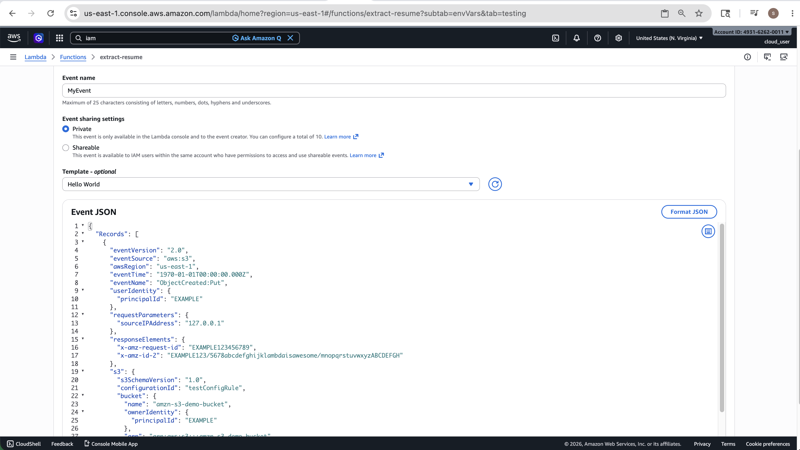
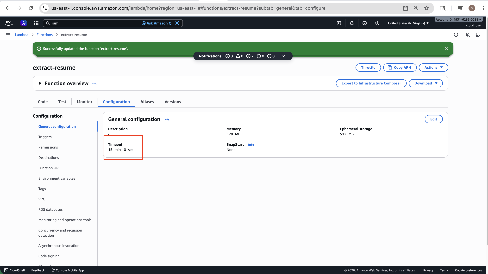

# 📄 Extract Resume Data using LLM

> Automatically extract structured data from PDF resumes using AWS Lambda, LangChain, and Ollama LLM — serverless, scalable, and fully event-driven.


---

## 🏗️ Architecture Overview

```
User (PDF) → S3 Bucket → [S3 Event: ObjectCreated] → AWS Lambda
                                                          ├── LangChain Framework
                                                          ├── Ollama LLM Model
                                                          └── Extract Resume Fields
                                                               └──→ Amazon DynamoDB
```

### Services Used

| Service | Role |
|---|---|
| **Amazon S3** | Stores uploaded PDF resumes; triggers Lambda on upload |
| **AWS Lambda** | Serverless compute; runs LangChain + Ollama to process resumes |
| **LangChain** | Framework for document loading, chunking, and LLM chaining |
| **Ollama LLM** | Local LLM model for extracting structured resume fields |
| **Amazon DynamoDB** | NoSQL database storing extracted resume data |
| **Lambda Layer** | Packages LangChain, Ollama client, and dependencies |
| **IAM Role / Policy** | Grants Lambda permissions to access S3 and DynamoDB |

---

## 🚀 Features

- **Event-driven**: S3 `ObjectCreated` trigger automatically invokes Lambda on every upload
- **Serverless**: No servers to manage — Lambda scales automatically
- **LLM-powered extraction**: Uses Ollama LLM via LangChain to extract structured fields
- **Structured storage**: Extracted data stored as items in DynamoDB for easy querying
- **Modular**: Lambda Layer keeps dependencies separate and reusable

---

## 📁 Project Structure

```
resume-pipeline/
├── lambda_function.py
├── llm_model.py
├── pdf_extract.py
├── prompts.py
├── put_items.py
├── requirements.txt
└── resume_schema.py
```


---

## ⚙️ Setup & Deployment

### Prerequisites

- AWS Account
- AWS Lambda
- AWS Bucket
- AWS DynamoDB
- Lambda Role with S3 and DynamoDB access
- Ollama api key(https://ollama.com/settings/keys)

### 1. Create the S3 Bucket


### 2. Build the Lambda Layer

```bash
mkdir python
pip install -r requirements.txt -t python/
zip -r my_layer.zip python
```
- Upload my_layer.zip into bucket
  

```
- Create lambda layer

```


### 3. IAM Role


### 4. IAM Policy


### 5. Deploy the Lambda Function


### 6. Add S3 Trigger


### 7. Add Layer


### 8. Create DynamoDB Table


### 9. Upload python file into lambda function

---
### 10. Add Lambda Even

- Replace us-east-1 with the region you created your Amazon S3 bucket in.
- Replace both instances of 'resume-parser-bkt-2026' with the name of your own Amazon S3 bucket.
- Replace 'Resume.pdf' with the name of the test object you uploaded to your bucket earlier(PDF Resume)

```json
{
  "Records": [
    {
      "eventVersion": "2.0",
      "eventSource": "aws:s3",
      "awsRegion": "us-east-1",
      "eventTime": "1970-01-01T00:00:00.000Z",
      "eventName": "ObjectCreated:Put",
      "userIdentity": {
        "principalId": "EXAMPLE"
      },
      "requestParameters": {
        "sourceIPAddress": "127.0.0.1"
      },
      "responseElements": {
        "x-amz-request-id": "EXAMPLE123456789",
        "x-amz-id-2": "EXAMPLE123/5678abcdefghijklambdaisawesome/mnopqrstuvwxyzABCDEFGH"
      },
      "s3": {
        "s3SchemaVersion": "1.0",
        "configurationId": "resume-parser-bkt-2026",
        "bucket": {
          "name": "amzn-s3-demo-bucket",
          "ownerIdentity": {
            "principalId": "EXAMPLE"
          },
          "arn": "arn:aws:s3:::resume-parser-bkt-2026"
        },
        "object": {
          "key": "Resume.pdf",
          "size": 1024,
          "eTag": "0123456789abcdef0123456789abcdef",
          "sequencer": "0A1B2C3D4E5F678901"
        }
      }
    }
  ]
}
```


### 11. Update Function Timeout value
- Keep 15 Min


## 🔐 IAM Policy

Attach this policy to the Lambda execution role:

```json
{
  "Version": "2012-10-17",
  "Statement": [
    {
      "Effect": "Allow",
      "Action": ["s3:GetObject"],
      "Resource": "arn:aws:s3:::resume-upload-bucket/*"
    },
    {
      "Effect": "Allow",
      "Action": ["dynamodb:PutItem", "dynamodb:GetItem"],
      "Resource": "arn:aws:dynamodb:*:*:table/ResumeData"
    },
    {
      "Effect": "Allow",
      "Action": ["logs:CreateLogGroup", "logs:CreateLogStream", "logs:PutLogEvents"],
      "Resource": "*"
    }
  ]
}
```

---

## 🌍 Environment Variables

Set these on your Lambda function:

| Variable | Value |
|---|---|
| `OLLAMA_API_KEY` | `your ollama key` |
| `OLLAMA_BASE_URL` | `https://api.ollama.com` |


---
