# 📄 AWS Resume Processing Pipeline

> Automatically extract structured data from PDF resumes using AWS Lambda, LangChain, and Ollama LLM — serverless, scalable, and fully event-driven.

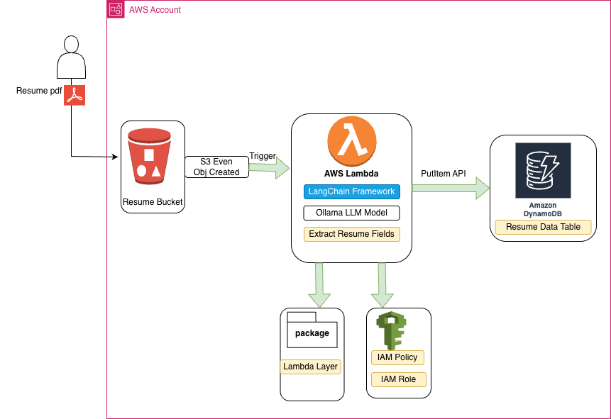

---

## 🏗️ Architecture Overview

```
User (PDF) → S3 Bucket → [S3 Event: ObjectCreated] → AWS Lambda
                                                          ├── LangChain Framework
                                                          ├── Ollama LLM Model
                                                          └── Extract Resume Fields
                                                               └──→ Amazon DynamoDB
```

### Services Used

| Service | Role |
|---|---|
| **Amazon S3** | Stores uploaded PDF resumes; triggers Lambda on upload |
| **AWS Lambda** | Serverless compute; runs LangChain + Ollama to process resumes |
| **LangChain** | Framework for document loading, chunking, and LLM chaining |
| **Ollama LLM** | Local LLM model for extracting structured resume fields |
| **Amazon DynamoDB** | NoSQL database storing extracted resume data |
| **Lambda Layer** | Packages LangChain, Ollama client, and dependencies |
| **IAM Role / Policy** | Grants Lambda permissions to access S3 and DynamoDB |

---

## 🚀 Features

- **Event-driven**: S3 `ObjectCreated` trigger automatically invokes Lambda on every upload
- **Serverless**: No servers to manage — Lambda scales automatically
- **LLM-powered extraction**: Uses Ollama LLM via LangChain to extract structured fields
- **Structured storage**: Extracted data stored as items in DynamoDB for easy querying
- **Modular**: Lambda Layer keeps dependencies separate and reusable

---

## 📁 Project Structure

```
resume-pipeline/
├── lambda_function.py
├── llm_model.py
├── pdf_extract.py
├── prompts.py
├── put_items.py
├── requirements.txt
└── resume_schema.py
```
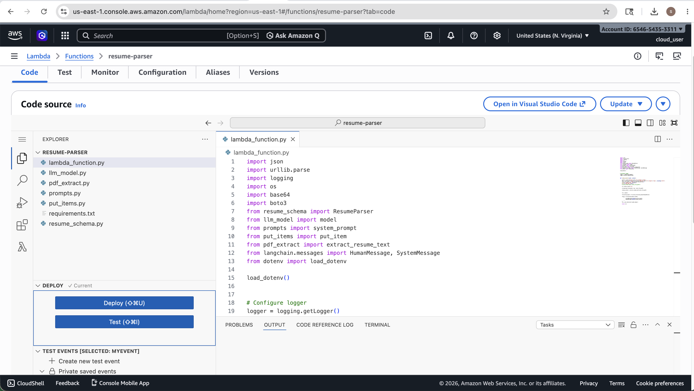

---

## ⚙️ Setup & Deployment

### Prerequisites

- AWS Account
- AWS Lambda
- AWS Bucket
- AWS DynamoDB
- Lambda Role with S3 and DynamoDB access
- Ollama api key(https://ollama.com/settings/keys)

### 1. Create the S3 Bucket
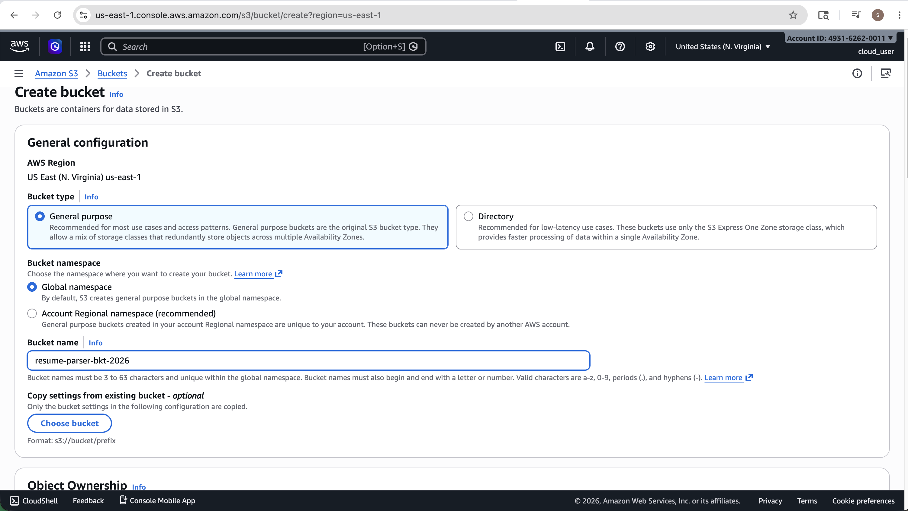

### 2. Build the Lambda Layer

```bash
mkdir python
pip install -r requirements.txt -t python/
zip -r my_layer.zip python
Upload my_layer.zip
```
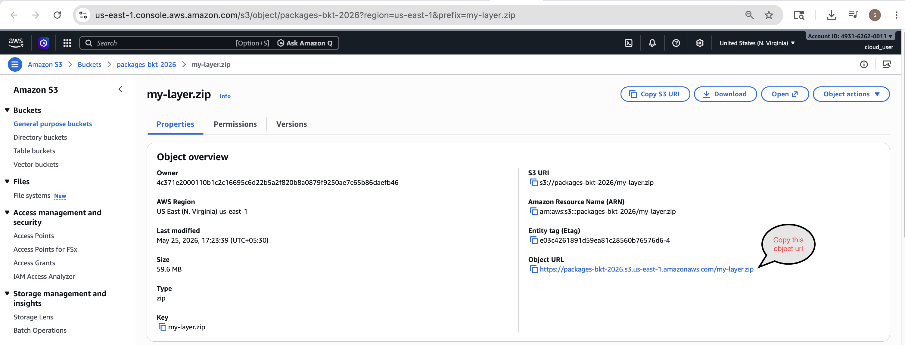
```
Create Layer
```
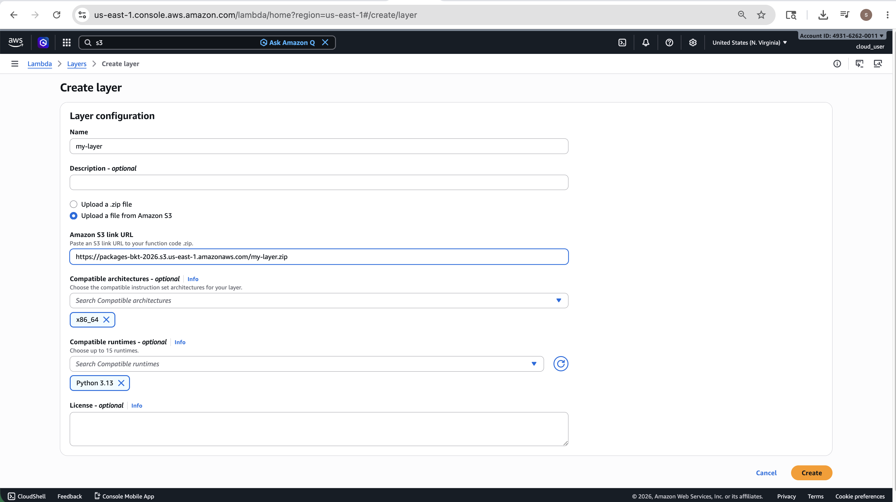

### 3. IAM Role
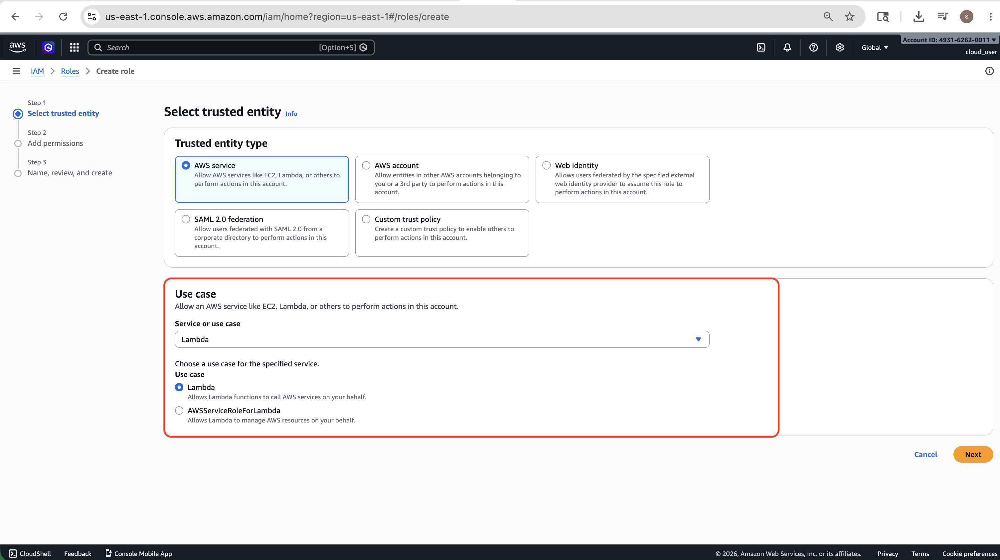

### 4. IAM Policy
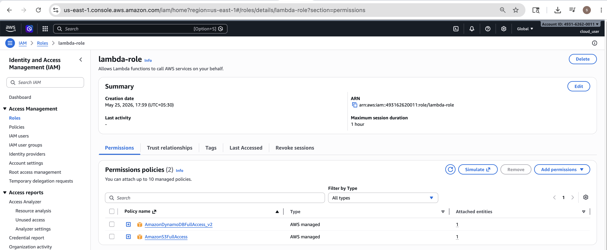

### 5. Deploy the Lambda Function

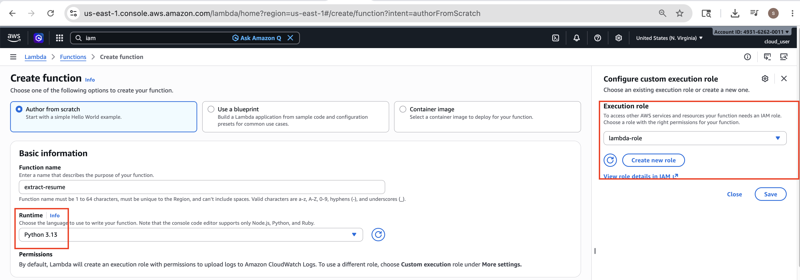

### 6. Add S3 Trigger

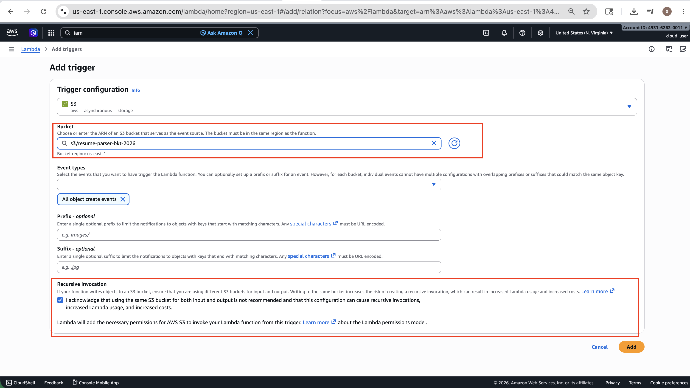

### 7. Add Layer

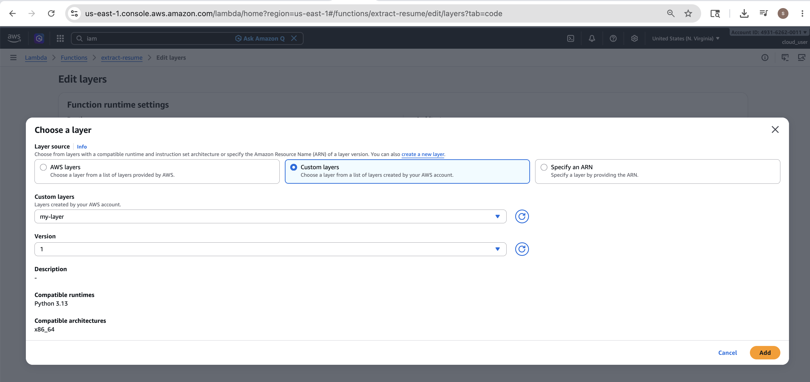

### 8. Create DynamoDB Table
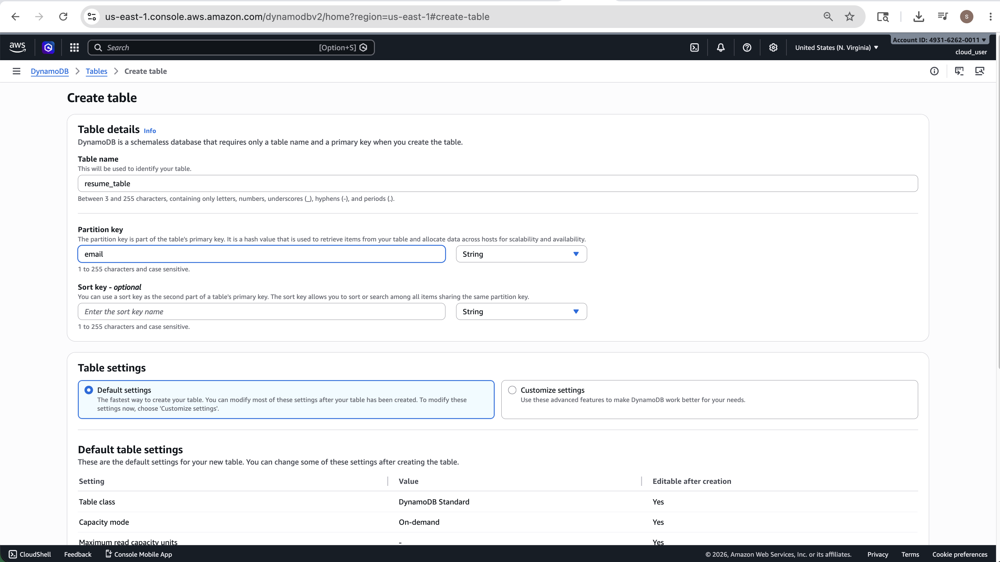

### 9. Upload python file into lambda function
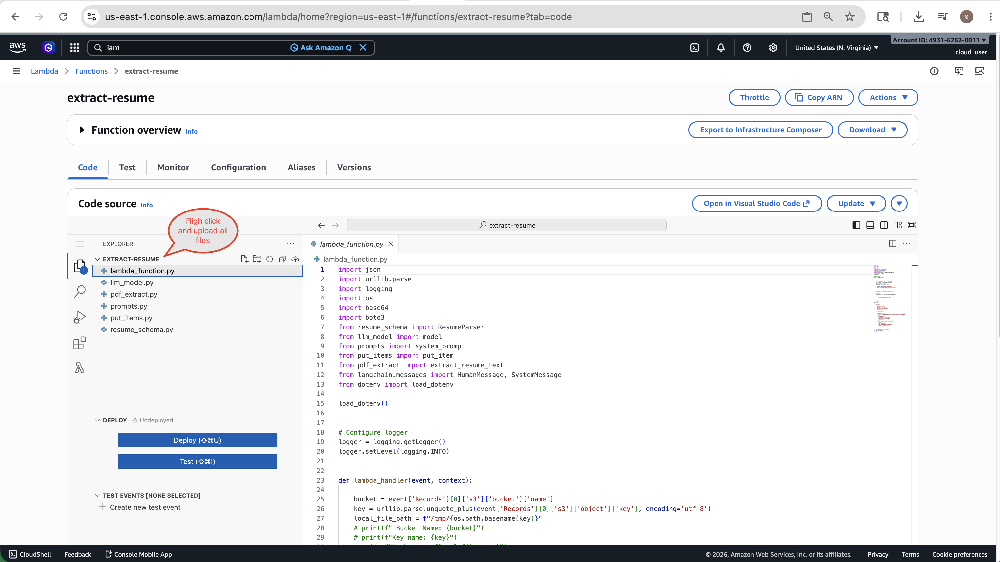
---

## 🧠 Lambda Handler (handler.py)

```python
import boto3
import json
from extractor import extract_resume_fields

s3 = boto3.client('s3')
dynamodb = boto3.resource('dynamodb')
table = dynamodb.Table('ResumeData')

def lambda_handler(event, context):
    bucket = event['Records'][0]['s3']['bucket']['name']
    key = event['Records'][0]['s3']['object']['key']

    # Download PDF from S3
    response = s3.get_object(Bucket=bucket, Key=key)
    pdf_bytes = response['Body'].read()

    # Extract fields using LangChain + Ollama
    extracted = extract_resume_fields(pdf_bytes, key)

    # Store in DynamoDB
    table.put_item(Item=extracted)

    return {'statusCode': 200, 'body': json.dumps('Resume processed successfully')}
```

## 🔍 Extractor (extractor.py)

```python
from langchain_community.document_loaders import PyPDFLoader
from langchain_community.llms import Ollama
from langchain.prompts import PromptTemplate
import tempfile, os

def extract_resume_fields(pdf_bytes: bytes, resume_id: str) -> dict:
    # Write PDF to temp file for LangChain loader
    with tempfile.NamedTemporaryFile(suffix='.pdf', delete=False) as tmp:
        tmp.write(pdf_bytes)
        tmp_path = tmp.name

    loader = PyPDFLoader(tmp_path)
    pages = loader.load()
    full_text = "\n".join([p.page_content for p in pages])
    os.unlink(tmp_path)

    llm = Ollama(model="llama3", base_url="http://<OLLAMA_HOST>:11434")

    prompt = PromptTemplate.from_template("""
    Extract the following fields from this resume as JSON:
    - full_name
    - email
    - phone
    - skills (list)
    - experience (list of: company, role, duration)
    - education (list of: institution, degree, year)

    Resume:
    {text}

    Return only valid JSON, no explanation.
    """)

    result = llm.invoke(prompt.format(text=full_text))
    fields = json.loads(result)
    fields['resumeId'] = resume_id
    return fields
```

---

## 🗄️ DynamoDB Schema

| Attribute | Type | Description |
|---|---|---|
| `resumeId` | String (PK) | S3 object key of the uploaded PDF |
| `full_name` | String | Candidate full name |
| `email` | String | Email address |
| `phone` | String | Phone number |
| `skills` | List | List of technical/soft skills |
| `experience` | List | Work experience entries |
| `education` | List | Education details |
| `processed_at` | String | ISO timestamp of processing |

---

## 🔐 IAM Policy

Attach this policy to the Lambda execution role:

```json
{
  "Version": "2012-10-17",
  "Statement": [
    {
      "Effect": "Allow",
      "Action": ["s3:GetObject"],
      "Resource": "arn:aws:s3:::resume-upload-bucket/*"
    },
    {
      "Effect": "Allow",
      "Action": ["dynamodb:PutItem", "dynamodb:GetItem"],
      "Resource": "arn:aws:dynamodb:*:*:table/ResumeData"
    },
    {
      "Effect": "Allow",
      "Action": ["logs:CreateLogGroup", "logs:CreateLogStream", "logs:PutLogEvents"],
      "Resource": "*"
    }
  ]
}
```

---

## 🌍 Environment Variables

Set these on your Lambda function:

| Variable | Value |
|---|---|
| `OLLAMA_API_KEY` | `your ollama key` |
| `OLLAMA_BASE_URL` | `https://api.ollama.com` |

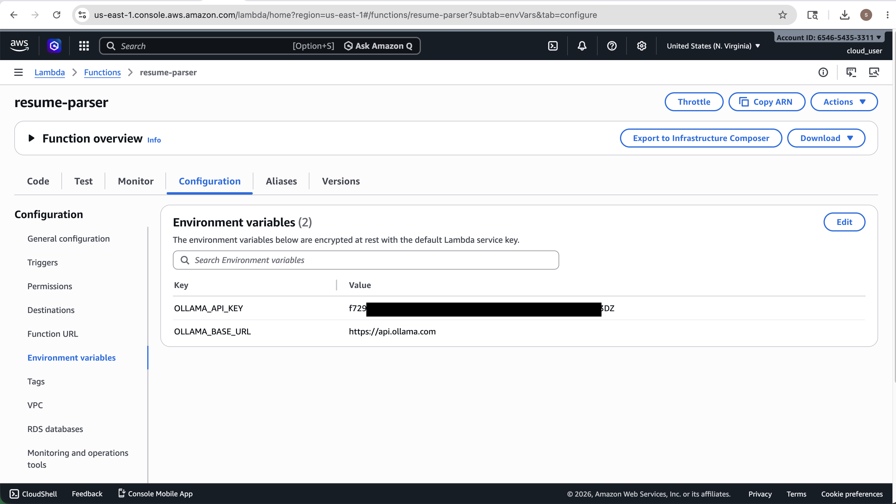

---

## 📌 Notes

- **Ollama hosting**: Run Ollama on an EC2 instance in the same VPC as Lambda, or package it as a container-based Lambda using `FROM ollama/ollama`.
- **Lambda timeout**: Set to at least **5 minutes** — LLM inference can be slow on large resumes.
- **Lambda memory**: Recommended **1–2 GB** for smooth PDF parsing and LLM calls.
- **PDF filter**: S3 trigger is filtered to `.pdf` suffix only to avoid processing other file types.

---

## 📜 License

MIT License — free to use and modify.
